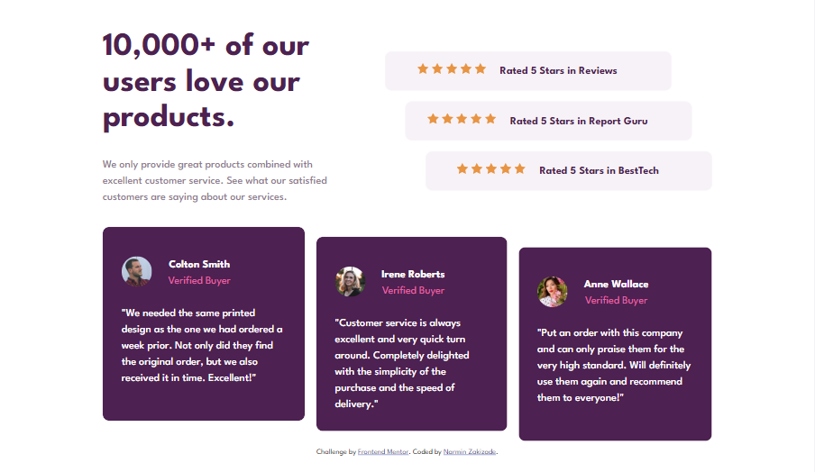
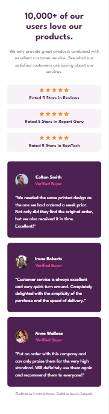

# Frontend Mentor - Social proof section solution

This is a solution to the [Social proof section challenge on Frontend Mentor](https://www.frontendmentor.io/challenges/social-proof-section-6e0qTv_bA). 

## Table of contents

- [Overview](#overview)
  - [The challenge](#the-challenge)
  - [Screenshot](#screenshot)
  - [Links](#links)
- [My process](#my-process)
  - [Built with](#built-with)
  - [What I learned](#what-i-learned)
  - [Useful resources](#useful-resources)

## Overview

### The challenge

Users should be able to:

- View the optimal layout for the section depending on their device's screen size

### Screenshot

### Links

- Solution URL: [solution URL](https://github.com/NarminZakizade/fem-Social-proof-section)
- Live Site URL: [live site URL](https://narminzakizade.me/fem-Social-proof-section)

## My process
I have used mobile-first approach,therefore styling was first written for mobile screens and later for desktop with media queries.
In CSS, I defined custom CSS properties and redefined them in media queries when any change was required in different screen sizes. I used CSS Reset (code taken from https://piccalil.li/blog/a-modern-css-reset/) to remove any discrepencies for browser default properties. I have used BEM naming convention.

### Built with

- Semantic HTML5 markup
- CSS custom properties
- CSS Reset
- BEM
- Flexbox
- Mobile-first workflow

### What I learned

I learned some best practices when writing this project. It includes having one h1 tag and one main tag in page.

### Useful resources

- [Example solution](https://www.youtube.com/watch?v=K27WULzr2P8&ab_channel=KevinPowell) - After completing my solution I watched this solution.

